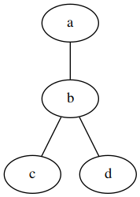

# Graphviz plugin for Inkdrop

[](https://dev.azure.com/jmerle/inkdrop-graphviz/_build/latest?definitionId=22&branchName=master)
[](https://my.inkdrop.app/plugins/graphviz)
[](https://github.com/jmerle/inkdrop-graphviz/blob/master/LICENSE)

This plugin makes it possible to add Graphviz graphs to notes. It is based on my [PlantUML plugin](https://my.inkdrop.app/plugins/plantuml) and supports all Graphviz layout programs.

## Install

```
ipm install graphviz
```

## Usage

First of all, make sure you got [Graphviz](https://www.graphviz.org/) installed and that `dot` is available on your `PATH`. If that's all done you can add code blocks like this:

    ```dot
    graph {
        a -- b -- c;
        b -- d;
    }
    ```

Which will be rendered as:



In the place of `dot` you can also use `neato`, `fdp`, `sfdp`, `twopi`, `circo`, `osage` or `patchwork` if the layout program you specify is available on your `PATH`.

## Changelog

See the [GitHub releases](https://github.com/jmerle/inkdrop-graphviz/releases) for an overview of what changed in each update.

## Contributing

All contributions are welcome. Please read the [Contributing Guide](https://github.com/jmerle/inkdrop-graphviz/blob/master/CONTRIBUTING.md) first as it contains information regarding the tools used by the project and instructions on how to set up a development environment.
